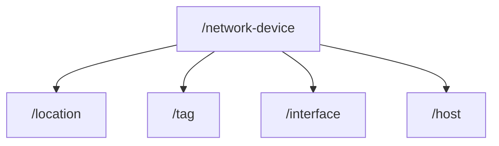

# DNA Center Notes
There are different categories of the APIs:
- Know Your Network
  - Can be used to discover details about clients, sites, topology and devices. Can also add devices to the network and export device data.
- Site Management
  - Helps provision enterprise networks with zero touch deployment and manage the activation and distribution of software images in the network.
- Connectivity
  - Provide the mechanism to configure and manage non-fabric wireless networks as a single step process.
- Operational Tasks
  - Provide programmatic access to DNA Center tasks such as configure and manage CLI templates, discover network devices, configure network settings and path trace through the network.
- Policy
  - Allow you programmatic access to create policies that reflect your organization's business intent for a particular aspect of the network, such as network access.
- Ecosystem Integrations
  - Provide details of the various third party integrations that are supported 

## Authentication
To authenticate to the DNA Center you would send a POST request to:
```
https://sandboxdnac.cisco.com/dna/system/api/v1/auth/token
```
With the Authorization request header set to basic authentication so something like
```
Ahtorization: Basic base64(username:pwd)
```
Then you would send this request and receive the authorization token for later use. To use the token you have to specify it with the **X-Auth-Token** header.
```
X-Auth-Token: tokenval
```

A sample of how to do it in python:
```
endpoint = '/dna/system/api/v1/auth/token'
dna_ip = "placeholder"
url = f"https://{placeholder}{endpoint}"

# Make the POST Request
resp = requests.post(url, auth=HTTPBasicAuth('username', 'password'), verify=False)

# Retrieve the Token from the returned JSON
token = resp.json()['Token']

# Print out the Token
print("Token Retrieved: {}".format(token))
```

## Working With Network Devices
The URL for working with network devices is:
```
https://sandboxdnac.cisco.com/api/v1/network-device
```
When using the endpoint remember to set the **x-auth-token** request header.

You can query a specific device if you know the managementIpaddrss or macAddress:
```
https://sandboxdnac.cisco.com/api/v1/network-device/?managementIpAddress=10.10.22.74&macAddress=00:c8:8b:80:bb:00
```
Not entirely sure if the macAddress is formatted correctly

Example for getting the list of devices:
```
token = get_auth_token() # Get Token
url = "https://sandboxdnac.cisco.com/api/v1/network-device"
hdr = {'x-auth-token': token, 'content-type' : 'application/json'}
resp = requests.get(url, headers=hdr, verify=False)  # Make the Get Request
device_list = resp.json()
```

The Learning Labs provide the following Python example for retrieving a list of all interfaces to a specific device:

```

import requests
from requests.auth import HTTPBasicAuth
from dnac_config import DNAC_IP, DNAC_PORT, DNAC_USER, DNAC_PASSWORD


def get_device_list():
    """
    Building out function to retrieve list of devices. Using requests.get to make a call to the network device Endpoint
    """
    global token
    token = get_auth_token() # Get Token
    url = "https://sandboxdnac.cisco.com/api/v1/network-device"
    hdr = {'x-auth-token': token, 'content-type' : 'application/json'}
    resp = requests.get(url, headers=hdr)  # Make the Get Request
    device_list = resp.json()
    get_device_id(device_list)


def get_device_id(device_json):
    for device in device_json['response']: # Loop through Device List and Retrieve DeviceId
        print("Fetching Interfaces for Device Id ----> {}".format(device['id']))
        print('\n')
        get_device_int(device['id'])
        print('\n')


def get_device_int(device_id):
    """
    Building out function to retrieve device interface. Using requests.get to make a call to the network device Endpoint
    """
    url = "https://sandboxdnac.cisco.com/api/v1/interface"
    hdr = {'x-auth-token': token, 'content-type': 'application/json'}
    querystring = {"macAddress": device_id} # Dynamically build the query params to get device specific Interface information
    resp = requests.get(url, headers=hdr, params=querystring) # Make the Get Request
    interface_info_json = resp.json()
    print_interface_info(interface_info_json)


def print_interface_info(interface_info):
    print("{0:42}{1:17}{2:12}{3:18}{4:17}{5:10}{6:15}".
          format("portName", "vlanId", "portMode", "portType", "duplex", "status", "lastUpdated"))
    for int in interface_info['response']:
        print("{0:42}{1:10}{2:12}{3:18}{4:17}{5:10}{6:15}".
              format(str(int['portName']),
                     str(int['vlanId']),
                     str(int['portMode']),
                     str(int['portType']),
                     str(int['duplex']),
                     str(int['status']),
                     str(int['lastUpdated'])))


def get_auth_token():
    """
    Building out Auth request. Using requests.post to make a call to the Auth Endpoint
    """
    url = 'https://sandboxdnac.cisco.com/dna/system/api/v1/auth/token'       # Endpoint URL
    resp = requests.post(url, auth=HTTPBasicAuth(DNAC_USER, DNAC_PASSWORD))  # Make the POST Request
    token = resp.json()['Token']    # Retrieve the Token
    return token    # Create a return statement for the Token


if name == "main":
    get_device_int()

```

## Visibility and Assurance With Path Trace
Path trace can show how traffic goes from point A to point B across the network. You can perform a path trace between two nodes within your network between a specified source device and a specified destination device. 

When you initiate a path trace, the Cisco DNA Center Platform APIs evaluate and collects network topology and routing data from the discovered devices. It then uses this data to calculate a path between the source and destination or Layer 3 interfaces, and presents the path in a path trace. The topology includes the path direction and the devices along the path including their IP addresses. The display also shows the protocol of the devices along the path: Switched, STP, ECMP, Routed, Trace Route, or other source types.

When Cisco DNA Center Platform discovers the network it builds an inventory of network devices, interfaces and hosts. These devices can have locations and tags.




The following is commonly used APIs of the Cisco DNA Center Platform:
- *https://{}/api/system/v1/auth/token*, gets and encapsulates user identity and role information to make access-control decisions. Also used to get token?
- *https://{}/api/v1/network-device*, gets the list of first 500 network devices sorted on hostname. Can be filtered using management IP address, mac addrses, hostname, location etc.
- *https://{}/api/v1/interface*, gets every interface on every network device.
- *https://{}/api/v1/host*, gets the hostname, the id of the vlan, the IP address and Mac address of the host, and the IP address of the network device to which the host is connected and much more.
- *https://{}/api/v1/flow-analysis*, the path trace endpoint to trace a path between two IP addresses. Waits for analysis to complete and returns the results.

### Creating the troubleshooting script
Reference:
```
https://github.com/CiscoDevNet/dnac-python-path-trace/blob/master/path_trace.py
```

## DNAC Command Runner
Used to initiate remote execution of OS native command line instructions. Can be accessed using GUI and the Intent API.

First step would be to figure out the set of valid read-only commands using the Intent API:
```
https://{{dnacenter}}:{{port}}/dna/intent/api/v1/network-device-poller/cli/legit-reads
```

Python sample of it being used:
```
"""
Some elements are omitted such as where the token comes from, host, port etc.
But these are not that important for the illustration.
"""

url = "https://{}:{}/api/v1/network-device-poller/cli/legit-reads".format(host,port)
headers = {
"X-Auth-Token": token
}
response = requests.get(url, headers=headers, verify=False)
response.raise_for_status()
print("Exec commands supported:")
print(json.dumps(response.json()['response'], indent=4))
```
Would return something like:
```
Exec commands supported:
[
	.
	.
	.
	"mping",
	"sh",
	"standby",
	"start-chat",
	"systat",
	.
	.
	.
]

```
Actually executing remote commands and obtaining the results consist of 4 code steps:
- Obtain target device UUID: GET .../network-device/ip-address/{ipAddress}
- Initiate the remote commands. (Returns: taskId): POST .../network-device-poller/cli/read-request
- Wait until the task completes: (On completion, returns: fileId): GET '.../task/{taskId}
- Obtain the results: GET /dna/intent/api/v1/file/{fileId}

## The Template Programmer and API
Template programmer is used to apply templates to devices. Templates are organized into *projects* containers. To view the tempaltes go to Cisco DNA Center -> login -> tools and then template editor.

To get all versions of a template use the following API:
```
dna/intent/api/v1/template-programmer/template/version/{templateId}
```

To see the variables that a template requires use the following API:
```
dna/intent/api/v1/template-programmer/template/{templateId}
```
To deploy a template you would create a POST request to:
```
/v1/template-programmer/template/deploy
```
However, this endpoint requires a payload containing template, devices and variables so something like:
```
body = {
        "templateId": "1baa7cb1-43af-4e1e-a91b-942856d7e3ec",
        "targetInfo": [
            {
                "id": "10.10.22.70",
                "type": "MANAGED_DEVICE_IP",
                "params": {"description": "changed by DNAC", "interface": "TenGigabitEthernet1/0/24"}
            }
        ]
    }
```
After the template is deployed you can check its status by polling it with a GET request to:
```
/v1/template-programmer/template/deploy/status/{deploymentId}
```


